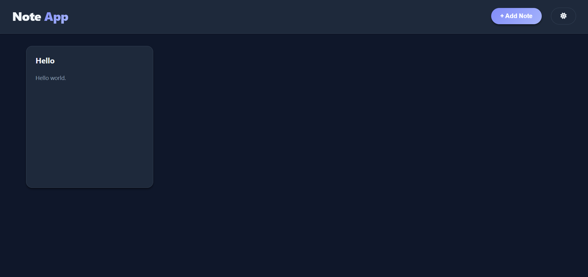
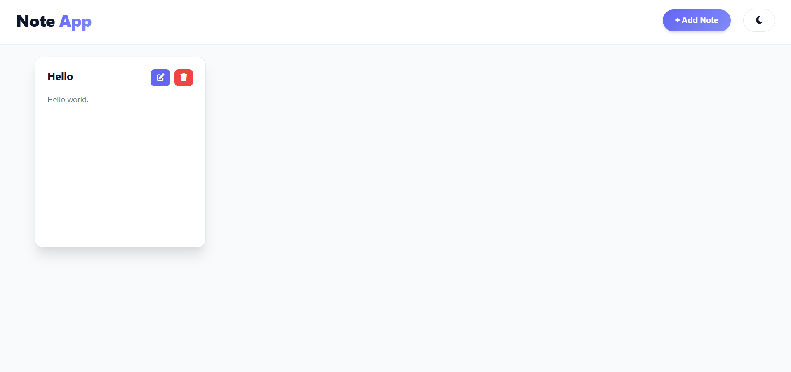
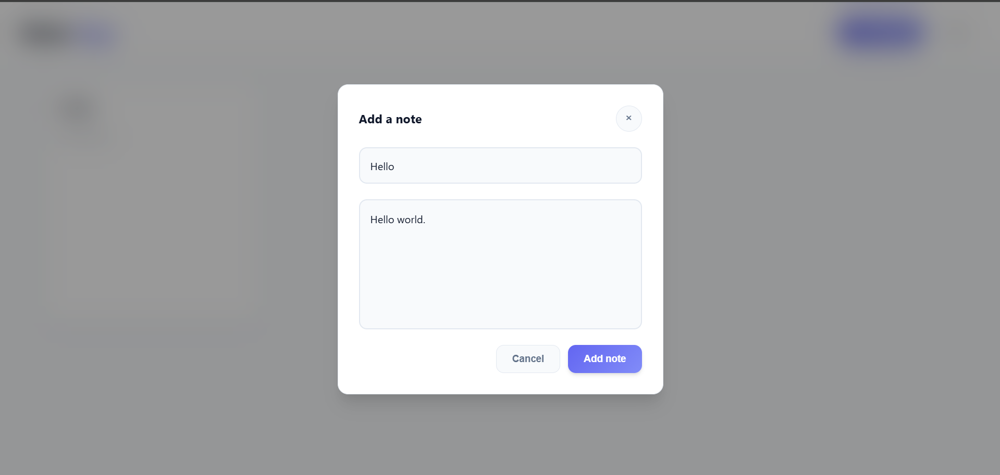

# **Note App**

A lightweight frontend-only note-taking application built using *HTML*, *CSS*, and *JavaScript*, with LocalStorage for data persistence.

This project focuses on core JavaScript fundamentals: DOM manipulation, event handling, and client-side storage.

## **Features**

- Add new notes
- Edit existing notes
- Delete notes
- Notes persist using LocalStorage
- Dark mode toggle
- Clean and minimal UI
- Fully client-side (no backend)


## **Tech Stack**

- **HTML5** – structure
- **CSS3** – styling & layout
- **JavaScript (ES6)** – logic & DOM manipulation
- **LocalStorage API** – data persistence

## **Screenshots**




## **How to run locally?**
- Clone the repository
    ```
    git clone https://github.com/CodeByAashik/Note-app.git
    cd Note-app
    ```
- Open the `index.html` in your browser

## **Project Structure**

```bash
.
├── index.html
├── js/
│   └── app.js
├── css/
│   └── style.css
├── screenshots/
│   ├── edit-modal.png
│   ├── home-dark.png
│   └── home-light.png
└── README.md
```

## **Possible Improvements**

- Search notes
- Tags or categories
- Export notes as text/JSON
- Keyboard shortcuts